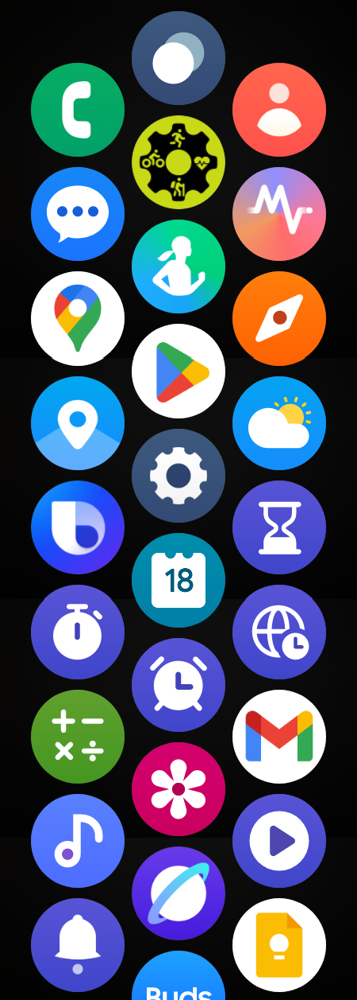
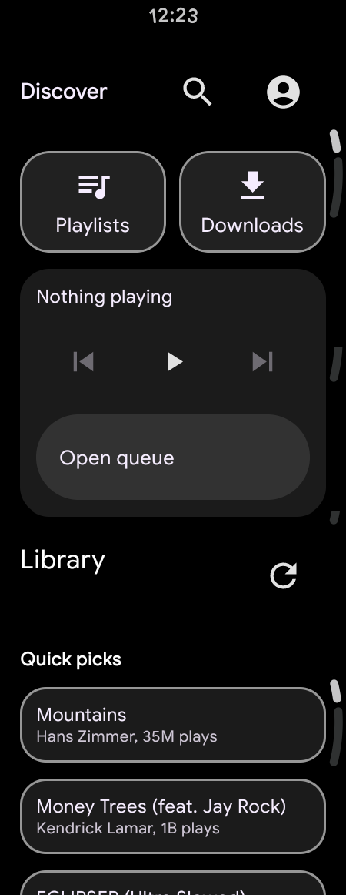
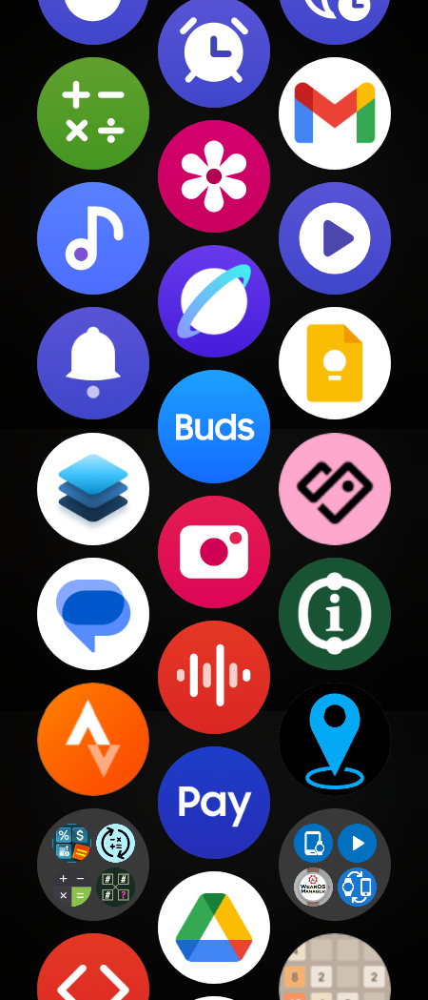

# WearCapture

WearCapture is a cross-platform desktop + CLI app that builds long vertically scrollable screenshots from a connected Wear OS device over local ADB.

No watch app. No root. No cloud.

## Highlights

- Captures watch frames with `adb exec-out screencap -p`
- Scrolls with `adb shell input swipe x1 y1 x2 y2 duration`
- Detects scroll termination using similarity + low-motion safeguards
- Detects overlap and stitches in memory (no intermediate image files)
- Exports final PNG (optional circular mask)
- Works over USB and Wi-Fi ADB
- Supports both CLI and desktop UI
- `Stop & Save` while capture is running

## Example Outputs (Real Watch Data)

These examples were generated from a connected Samsung Wear OS watch.





## Requirements

- Python 3.10+
- ADB binary available in `PATH` (or use `--adb-path`)
- Python packages:
  - `numpy`
  - `Pillow`

Install dependencies:

```bash
python3 -m pip install -r requirements.txt
```

## Quick Start

List devices:

```bash
python3 -m wearcapture devices
```

Simple capture:

```bash
python3 -m wearcapture capture --output out.png
```

Advanced capture:

```bash
python3 -m wearcapture capture \
  --advanced \
  --serial 192.168.1.77:5555 \
  --swipe-x1 220 --swipe-y1 340 \
  --swipe-x2 220 --swipe-y2 110 \
  --swipe-duration-ms 320 \
  --scroll-delay-ms 550 \
  --similarity-threshold 0.995 \
  --max-swipes 35 \
  --output out.png
```

Launch desktop UI:

```bash
python3 -m wearcapture ui
```

## UI Notes

- `Simple` mode auto-computes swipe coordinates.
- `Advanced` mode exposes swipe coordinates and timing.
- `Start Capture` begins capture/stitching.
- `Stop & Save` stops safely and writes the stitched image from frames collected so far.

## Architecture

- `wearcapture/adb.py`: ADB wrapper (devices, screenshot, swipe, display size)
- `wearcapture/image_ops.py`: SSIM/pixel similarity, overlap detection, stitching, circular mask
- `wearcapture/capture_engine.py`: capture loop, termination logic, partial-stop save
- `wearcapture/ui.py`: desktop UI
- `wearcapture/cli.py`: CLI entrypoints
- `wearcapture/config.py`: shared configuration + validation

## Design Constraints (v1)

- Cross-platform: Windows/macOS/Linux
- No Android SDK requirement beyond ADB binary
- Supports Wi-Fi ADB devices
- Fails gracefully if ADB is missing
- In-memory frame processing

## Troubleshooting

- `ADB binary was not found`: install ADB platform-tools and verify `adb version` works.
- `No online ADB devices found`: verify `adb devices -l`, authorize device, ensure watch debugging is enabled.
- Capture runs too long: lower `max_swipes` or increase `similarity_threshold` in advanced mode.
- Stops too early: decrease `similarity_threshold` and/or increase swipe distance.
